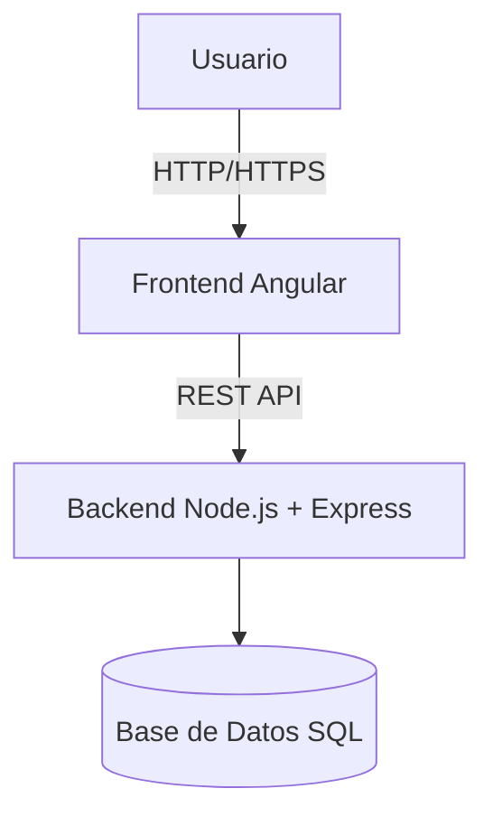
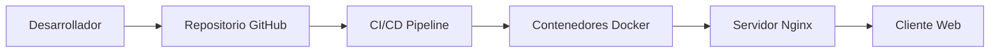

# 📘 Documentación Técnica

## 1. Información General
**Proyecto:** Marcador de Baloncesto en Tiempo Real  
**Versión:** 1.0  
**Autores:** Equipo de Desarrollo – Proyecto Universitario  
**Fecha:** Agosto 2025  

**Descripción:**  
Este proyecto consiste en el desarrollo de una aplicación web que simula un marcador de baloncesto en tiempo real. Permite gestionar puntos, tiempo de juego, cuartos y faltas, mostrando una interfaz intuitiva y responsiva. Además, incluye persistencia de partidos en un backend con base de datos para guardar y cargar resultados.

---

## 2. Arquitectura Tecnológica
El sistema está compuesto por **tres capas principales**:  

- **Frontend (Angular 18)**
  - Interfaz gráfica de usuario (UI).  
  - Renderización del tablero de baloncesto.  
  - Comunicación con backend mediante API REST.  

- **Backend (Node.js + Express)**
  - Exposición de API REST.  
  - Lógica de negocio (guardar/cargar partido).  
  - Validaciones de datos.  

- **Base de Datos (PostgreSQL / MariaDB)**
  - Persistencia de partidos, equipos, estadísticas.  
  - Relación centralizada entre partidos y jugadores.  

### Diagrama General


---

## 3. Requisitos del Sistema
### Cliente
- Navegador compatible con ES6+ (Chrome, Edge, Firefox).  
- Resolución mínima recomendada: **1366x768**.  

### Servidor
- **Node.js:** >= 22.x  
- **Angular CLI:** >= 18.x  
- **Base de Datos:** PostgreSQL >= 14   
- **Servidor Web (Producción):** Nginx 
- **Sistema Operativo:**  Linux (Ubuntu Server 22.04).  

---

## 4. Instalación y Configuración

### 4.1 Clonar el repositorio
```bash
git clone https://github.com/Alejmm/ProyectoI
cd proyecto-marcador
```

### 4.2 Configuración del Frontend (Angular)
```bash
cd frontend
npm install
ng serve
```
El sistema queda accesible en:  
👉 `http://localhost:4200`

**Estructura del frontend:**
```
frontend/
 ├── src/
 │   ├── app/
 │   │   ├── components/   # Componentes UI
 │   │   ├── services/     # Comunicación con backend
 │   │   ├── models/       # Interfaces de datos
 │   │   └── app.module.ts
 │   ├── assets/           # Imágenes, estilos
 │   └── main.ts
```

### 4.3 Configuración del Backend (Node.js + Express)
```bash
cd backend
npm install
npm run dev
```
Por defecto disponible en:  
👉 `http://localhost:3000`

**Estructura del backend:**
```
backend/
 ├── src/
 │   ├── controllers/   # Lógica de negocio
 │   ├── routes/        # Endpoints API REST
 │   ├── models/        # Esquemas BD
 │   ├── config/        # Configuración DB
 │   └── app.js
 ├── package.json
 └── server.js
```

**Archivo `.env` de ejemplo:**
```env
PORT=3000
DB_HOST=localhost
DB_PORT=5432
DB_USER=marcador_user
DB_PASS=12345
DB_NAME=marcador
```

### 4.4 Configuración de la Base de Datos

#### PostgreSQL
```sql
CREATE DATABASE marcador;

CREATE TABLE partido (
  id SERIAL PRIMARY KEY,
  equipo_local VARCHAR(50),
  equipo_visitante VARCHAR(50),
  puntos_local INT DEFAULT 0,
  puntos_visitante INT DEFAULT 0,
  faltas_local INT DEFAULT 0,
  faltas_visitante INT DEFAULT 0,
  cuarto INT DEFAULT 1,
  tiempo_restante VARCHAR(10)
);
```

#### MariaDB
```sql
CREATE DATABASE marcador;

CREATE TABLE partido (
  id INT AUTO_INCREMENT PRIMARY KEY,
  equipo_local VARCHAR(50),
  equipo_visitante VARCHAR(50),
  puntos_local INT DEFAULT 0,
  puntos_visitante INT DEFAULT 0,
  faltas_local INT DEFAULT 0,
  faltas_visitante INT DEFAULT 0,
  cuarto INT DEFAULT 1,
  tiempo_restante VARCHAR(10)
);
```

---

## 5. Endpoints del Backend (API REST)

| Método   | Endpoint            | Descripción                  |
|----------|---------------------|------------------------------|
| `POST`   | `/api/partidos`     | Crear un nuevo partido       |
| `PUT`    | `/api/partidos/:id` | Actualizar partido existente |

**Ejemplo de creación (`POST /api/partidos`):**
```json
{
  "equipo_local": "Lakers",
  "equipo_visitante": "Bulls",
  "puntos_local": 0,
  "puntos_visitante": 0,
  "faltas_local": 0,
  "faltas_visitante": 0,
  "cuarto": 1,
  "tiempo_restante": "10:00"
}
```

---

## 6. Arquitectura de Despliegue


- **Desarrollo local:** Angular + Node.js ejecutándose en puertos distintos.  
- **Producción:** 
  - Angular compilado (`ng build --prod`) y servido por **Nginx**.  
  - Backend ejecutado en **Node.js** o contenedor Docker.  
  - Base de datos desplegada en servidor SQL.  

---

## 7. Seguridad y Buenas Prácticas
- Uso de **.env** para credenciales.  
- Sanitización de datos antes de enviar a la base de datos.  
- Uso de **CORS** controlado en backend.  
- Validación de payloads con **express-validator**.  
- Logs centralizados para auditoría.  

---

## 8. Pruebas
### Pruebas unitarias (Jest - backend)
```bash
npm run test
```

### Pruebas e2e (Cypress - frontend)
```bash
npx cypress open
```

---

## 9. Mantenimiento
- Actualizar dependencias cada sprint con `npm audit fix`.  
- Respaldos automáticos de la base de datos (cron jobs).  
- Monitoreo de logs en backend con **PM2**.  
- Integración con herramientas de métricas (Grafana/Prometheus).  

---

## 10. Futuras Extensiones
- Gestión de **roster de jugadores** y estadísticas individuales.  
- Exportación de partidos en **PDF/Excel**.  
- Integración con pantallas LED vía WebSocket.  
- Sistema de usuarios con roles (árbitro, anotador, espectador).  
